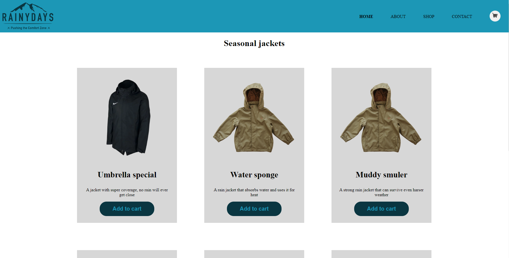

# Cross course project - Rainydays

## Description

This is a rain jacket website example. Showing different jackets on the main page. Allowing the user to see a selection of jackets. The user can also filter jackets by male/female and have a short description of the jacket itself by clicking on them.

## Built With

- HTML/CSS/JS
- Wordpress rest API

## Getting Started

### Installing

1. Clone the repo.

### Running

To run the app, do the following:

1. Open the index.html file.

## Contact

You can contact me on [www.mrdigi.tv](https://mrdigi.tv/contact/)
